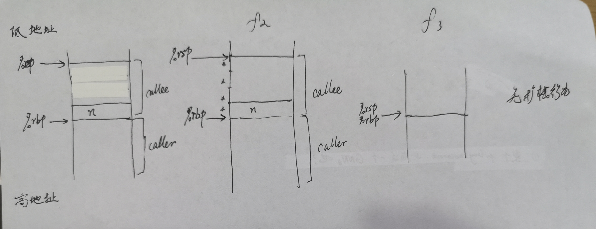
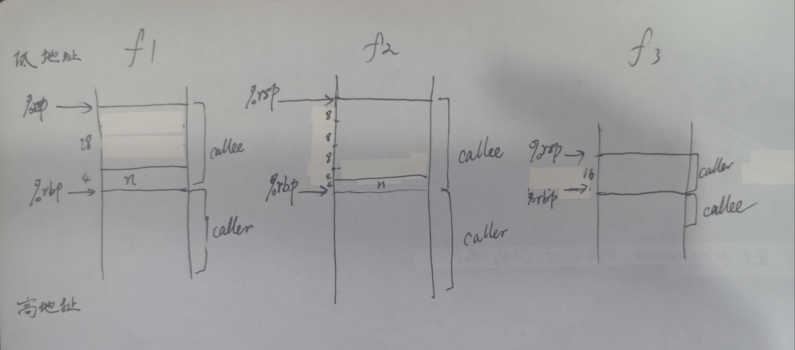

# step3

## 1. 分析 `src/fact.c`

### 1)

不考虑前面的 `step` 描述过的不同, 经过 `diff`, 我能找到的不同只有以下这个:

即 `f3()` 中的
- x86: 
    ```llvm
    %9 = call i32 (i32, ...) bitcast (i32 ()* @f3 to i32 (i32, ...)*)(i32 %8)
    ```
- arm:
    ```llvm
    %9 = call i32 bitcast (i32 ()* @f3 to i32 (i32)*)(i32 %8)
    ```

为了了解其为何有此区别, 我首先描述一下这句是用来做什么的.

首先, 这里的 `%8` 实际上就是源码中的 `n-1`, 而 `%9` 后来被用于与 `n` 相乘, 这意味着 `%9=...` 就是在调用函数 `f3()`

正常来说, 函数调用就是如 `f1` 里的那样
```llvm
call i32 @f1(i32 %10)
```

而这里与它的区别则在于有一个 `bitcast .. to ..` 操作, 它将 `@f3` 从类型 `i32 ()*` 变为 `i32 (i32, ...)*`

为什么有这样一个语句呢? 想了半天我发现 `f3()` 原本是个无参数的函数, 但调用的时候却给了参数, 因此 `IR` 只能做对应的类型转换来满足要求.

### 2)

10-37 行的注释(也就是 `f2` 的注释)
```llvm
define dso_local i32 @f2(i32 %0) #0 {     ; 函数声明
  %2 = alloca i32, align 4                ; 分配空间给 返回值
  %3 = alloca i32, align 4                ; 分配空间给 n
  store i32 %0, i32* %3, align 4          ; 存 n
  %4 = load i32, i32* %3, align 4         ; 取 n
  store i32 %4, i32* @f2.m, align 4       ; 存 n 到静态变量 @f2.m
  %5 = load i32, i32* @f2.m, align 4      ; 读 @f2.m 到 %5
  %6 = icmp eq i32 %5, 0                  ; 判 m == 0
  br i1 %6, label %7, label %8            ; 跳转

7:                                                ; preds = %1
  store i32 1, i32* %2, align 4           ; 存 1 到 %2
  br label %14                            ; 跳转到 return 1

8:                                                ; preds = %1
  %9 = load i32, i32* @f2.m, align 4      ; 取 @f2.m 到 %9
  %10 = load i32, i32* @f2.m, align 4     ; 取 @f2.m 到 %10
  %11 = sub nsw i32 %10, 1                ; 求 n-1
  %12 = call i32 @f2(i32 %11)             ; 调用 f2(n-1)
  %13 = mul nsw i32 %9, %12               ; n*f2(n-1)
  store i32 %13, i32* %2, align 4         ; 存计算结果到返回值地址
  br label %14                            ; 返回

14:                                               ; preds = %8, %7
  %15 = load i32, i32* %2, align 4        ; 读取返回值
  ret i32 %15                             ; 返回
}
```

92-97行对应 `main` 函数
```llvm
define dso_local i32 @main() #0 {
  %1 = call i32 @f1(i32 3)    ; 调用函数 f1(3)
  %2 = call i32 @f2(i32 3)    ; 调用函数 f2(3)
  ; 调用函数 printf
  %3 = call i32 (i8*, ...) @printf(i8* getelementptr inbounds ([7 x i8], [7 x i8]* @.str, i64 0, i64 0), i32 %1, i32 %2)
  ret i32 0                   ; 默认返回 0
}
```

### 3)

不同之处:
- `f2` 和 `f1` 的区别在于 `f2` 有一个静态变量 `m` 要处理. 每次使用它的时候就是去存取 `@f2.m` 的内容, 而 `f1` 没有, 他就是单纯的函数调用使用参数.
- `f1` 和 `f3` 的区别有两个:
    - 一个是调用了外部变量, 用 `@n`
    - 一个是函数调用传参的时候, 参数数量不匹配, 多了一个 `bitcast` 进行转换.

### 4)

#### 代码注释
这里面有个很常用的结构, 如
```asm
adrp	x0, .LC0            ; 获取页基址
add	x0, x0, :lo12:.LC0      ; 计算.LC0 地址(即字符串 "%d, %d")
```
它是先获取页基址, 然后通过偏移量计算出了地址.

4-36行, 即 `f2` :

```asm
    .align	2						;
    .global	f2						;
    .type	f2, %function			; 对函数定义的描述
f2:
    stp	x29, x30, [sp, -32]!		; 入栈指令
    add	x29, sp, 0					;
    str	w0, [x29, 28]				; 存 w0 (即n)
    adrp	x0, m.3259				; m.3259 页基址
    add	x0, x0, :lo12:m.3259        ; 读取 m.3259 的地址
    ldr	w1, [x29, 28]               ; 读取 n 到 w1
    str	w1, [x0]                    ; 存 w1 到 x0
    adrp	x0, m.3259              ; 读 m.3259 页基址址
    add	x0, x0, :lo12:m.3259        ; 读 m.3259 地址
    ldr	w0, [x0]                    ; 把 n 存到 m 的地址
    cmp	w0, 0                       ; 比较 n 和 0
    bne	.L2                         ; 不等则跳  .L2, 否则
    mov	w0, 1                       ; 赋值返回值 w0 为 1
    b	.L3                         ; 并跳转到 .L3 以返回
.L2:
    adrp	x0, m.3259              ; 读 m.3259 页基址
    add	x0, x0, :lo12:m.3259        ; 获取 m.3259 地址
    ldr	w0, [x0]                    ; 读取 m
    sub	w0, w0, #1                  ; 计算 m-1
    bl	f2                          ; 调用函数 f2
    mov	w1, w0                      ; 获取返回值
    adrp	x0, m.3259              ; 
    add	x0, x0, :lo12:m.3259        ; 获取 m 地址
    ldr	w0, [x0]                    ; 读 m
    mul	w0, w1, w0                  ; 做乘法并准备返回
.L3:
    ldp	x29, x30, [sp], 32          ; 出栈指令
    ret                             ; 返回
    .size	f2, .-f2                ; 符号大小
```

108-118行
```asm
    mov	w0, 3                   ; w0 = 3
    bl	f1                      ; 调用 f1(3)
    mov	w19, w0                 ; 获取返回值 w19=f1(3)
    mov	w0, 3                   ; w0=3
    bl	f2                      ; 调用 f2(3)
    mov	w1, w0                  ; 获取返回值 w1 = f2(3)
    adrp	x0, .LC0            ; 获取页基址
    add	x0, x0, :lo12:.LC0      ; 计算.LC0 地址(即字符串 "%d, %d")
    mov	w2, w1                  ; 参数 f2(3)
    mov	w1, w19                 ; 传参 f1(3)
    bl	printf                  ; 调用 printf
```

#### 和 `arm/fact.ll` 的对应关系与区别:

- 对应关系非常明显:
    - 除了过程上的一致
    - 还有取静态变量的 `f2.m` 和 `m.3259`
    - 函数调用也非常类似
- 区别:
    - 取 `m` 等不必先取页基址再偏移.
    - `LLVM IR` 本身有很清楚的类型说明, 这是汇编远不能及的
    - 汇编代码中, 调用函数前用寄存器准备好参数, 但不是显示指示的
    - 汇编代码中有栈管理的东西.


### 5)

不同之处:
- 同样地, `f1` 不必去取静态变量 `m` 来执行函数, 因此没有类似这样的语句
    ```asm
    adrp	x0, m.3259              ;
    add	x0, x0, :lo12:m.3259        ; 获取 m 地址
    ```
- 入栈出栈大小不同, 这是自然的. 因为其内部变量数目不太一样
- 其他比较类似的就不提了

### 6)
不同之处:
- `m.3259` 和 `f2.m` 的不同: 这在前面的 `step` 出现过了
- `clang` 入栈是 `stp	x29, x30, [sp, #32]`, 而 `gcc` 是 先减法再`stp	x29, x30, [sp, -32]!`, 这没什么太大含义
- 会发现, `gcc` 先取出 f2(m-1) 返回值 再取 `m` 来计算, 因此得到了0. 而 `clang` 先取 `m`, 再计算调用函数, 因此得到一个6

其他都差不多

### 7)

#### 代码注释
3-36行:
```asm
	.globl	f2						; 全局符号
	.type	f2, @function			; 类型为函数
f2:
.LFB0:
	.cfi_startproc					
	pushq	%rbp					; 基址寄存器入栈
	.cfi_def_cfa_offset 16
	.cfi_offset 6, -16
	movq	%rsp, %rbp				; %rbp = %rsp
	.cfi_def_cfa_register 6
	subq	$16, %rsp				; 扩栈
	movl	%edi, -4(%rbp)			; 存 n
	movl	-4(%rbp), %eax			; %eax = n
	movl	%eax, m.2248(%rip)		; m = n
	movl	m.2248(%rip), %eax		; %eax = m
	testl	%eax, %eax				; 
	jne	.L2							; 如不相等则跳转到 .L2
	movl	$1, %eax				; 准备返回值
	jmp	.L3							; 跳转到返回
.L2:
	movl	m.2248(%rip), %eax		; %eax = m
	subl	$1, %eax				; 求 m-1
	movl	%eax, %edi				; 通过 %edi 传参
	call	f2						; 调用函数
	movl	%eax, %edx				; 取返回值
	movl	m.2248(%rip), %eax		; 取 m
	imull	%edx, %eax				; 计算 m*f2(m-1)
.L3:
	leave							
	.cfi_def_cfa 7, 8
	ret								; 返回
	.cfi_endproc
.LFE0:
	.size	f2, .-f2				; 符号大小
```

122-131行:
```asm
	movl	$3, %edi		; 准备参数 3
	call	f2				; 调用 f2
	movl	%eax, %ebx		; %ebx = f2(3)
	movl	$3, %edi		; 准备参数 3
	call	f1				; 调用 f1
	movl	%ebx, %edx		; %edx = f3(3)
	movl	%eax, %esi		; 准备参数 f(2)
	movl	$.LC0, %edi		; 准备参数 "%d, %d"
	movl	$0, %eax		; 
	call	printf			; 调用 printf
```

#### 与 `arm/fact.ll` 中代码关系与区别

- 对应关系:
    - 只要注释过一遍代码, 很显然能够看出来, 整个过程甚至代码块都几乎一致
- 区别:
    - `LLVM IR` 本身有很清楚的类型说明, 这是汇编远不能及的
    - 汇编代码中, 调用函数前用寄存器准备好参数, 但不是显示指示的
    - 汇编代码中有栈管理的东西.

#### 与 `arm/fact.s` 中代码关系与区别

- 对应关系:
    - `x86/fact.s` 的 3-36 行对应 `arm/fact.s` 的 4-36 行
    - `x86/fact.s` 的 122-131 行对应 `arm/fact.s` 的 122-131 行
- 区别:
    - 函数调用用 `call` 和 `bl`
    - 读 `m` 时, `arm` 有基址偏移的方法, 而 `x86` 直接读
    - `arm` 似乎倾向于用栈顶指针的偏移, 而 `x86` 则用栈基址指针的偏移

### 8)
不同之处:
- `f2` 中静态变量是用 `m.标号` 的格式, 而全局变量用 `n` 之类的格式: 这是由于静态变量存在静态区, 可能有重名等问题
- 其他都是小差别

### 9)

形参实参处理特点
- `x86`: 实参处理的时候通过寄存器(如 `%edi`)传递, 而"形参"(实际并无)没有被处理
- `arm`: 实参处理是通过寄存器(如 `w0`)传递, 而"形参"(实际并无)没有被处理

下面以 `gcc` 为例说明:
#### x86


#### arm



## 2. 分析 `step3/func1.c`

用以下这样一个简单的程序来完成实验:
```c
float fun1(int i) {
    return i;
}

double fun2(int i) {
    return i;
}

void main() {
    fun1(3);
    fun2(5);
}

```

### LLVM IR

- 函数传参时, 会利用 `fptosi` 等指令将实参转化为形参对应类型再传入
- 返回时, 同样也会用 `sitofp` 等指令将返回值转化为函数指定的返回值类型再返回

### x86

- 和 `LLVM IR` 类似, 只不过汇编之下, 64位情况用的是 `cvtsi2ssl`, `cvttss2sil` 之类的指令; 32位用的是 `fildl` 之类的指令(用以把整型传入浮点寄存器)

### arm

- 也类似, 只不过使用的是 `scvtf`, `fcvtzs` 等指令.