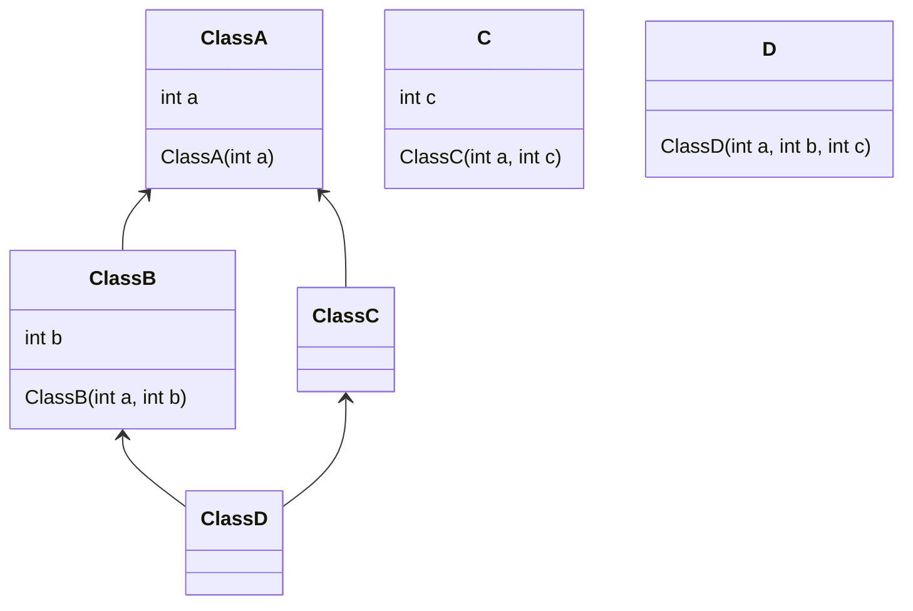

# 1

PB18111697 王章瀚

---

针对本题, 我写了个简单的菱形继承的类, 其关系如下:



## 整体分析
在使用了 `虚继承` 的情况下, 必须为基类 `A` 指定构造方式.
```cpp
ClassD(int a, int b, int c):
    ClassA(a), ClassB(a, b), ClassC(a, c) {}
```
而其对应输出的 `a` 变量也确实为通过 `ClassA` 的构造函数构造的结果.
```shell
================================= My Test Output ===============================
a.a: 1
b.a: 1  b.b: 2
c.a: -1 c.b: 3
d.a: 1  d.ClassB::a: 1  d.ClassC::a: 1  d.b: 2  d.c: 3
```

但不使用 `虚继承`, 虽然构造时不必专门有个类似 `ClassA(a)` 的东西, 但访问 `a` 时需要指定是哪个基类的. 如
```cpp
d.ClassB::name;
d.ClassC::name;
```
其输出也相应地是:
```shell
================================= My Test Output ===============================
a.a: 1
b.a: 1  b.b: 2
c.a: -1 c.b: 3
d.ClassB::a: 1  d.ClassC::a: 1  d.b: 2  d.c: 3
```

## 1)

### 完整信息
通过 `nm` 能够得到下列结果:
```shell
nm virtual | grep -E "ClassA|ClassB|ClassC|ClassD" | grep -E "C[1-9]" | awk '{print $3}'
_ZN6ClassAC1Ei
_ZN6ClassAC2Ei
_ZN6ClassBC1Eii
_ZN6ClassBC2Eii
_ZN6ClassCC1Eii
_ZN6ClassCC2Eii
_ZN6ClassDC1Eiii
...
```

```shell
nm novirtual | grep -E "ClassA|ClassB|ClassC|ClassD" | grep -E "C[1-9]" | awk '{print $3}'
_ZN6ClassAC1Ei
_ZN6ClassAC2Ei
_ZN6ClassBC1Eii
_ZN6ClassBC2Eii
_ZN6ClassCC1Eii
_ZN6ClassCC2Eii
_ZN6ClassDC1Eiii
_ZN6ClassDC2Eiii
```

借助我自己编写的 `demangler.cpp`(使用了 `cxxabi` 的 `demangle`), 可以得到
```shell
./demangler novirtual_class_symbol.log 
_ZN6ClassAC1Ei
        ClassA::ClassA(int)
_ZN6ClassAC2Ei
        ClassA::ClassA(int)
_ZN6ClassBC1Eii
        ClassB::ClassB(int, int)
_ZN6ClassBC2Eii
        ClassB::ClassB(int, int)
_ZN6ClassCC1Eii
        ClassC::ClassC(int, int)
_ZN6ClassCC2Eii
        ClassC::ClassC(int, int)
_ZN6ClassDC1Eiii
        ClassD::ClassD(int, int, int)
_ZN6ClassDC2Eiii
        ClassD::ClassD(int, int, int)
```

```shell
./demangler virtual_class_symbol.log 
_ZN6ClassAC1Ei
        ClassA::ClassA(int)
_ZN6ClassAC2Ei
        ClassA::ClassA(int)
_ZN6ClassBC1Eii
        ClassB::ClassB(int, int)
_ZN6ClassBC2Eii
        ClassB::ClassB(int, int)
_ZN6ClassCC1Eii
        ClassC::ClassC(int, int)
_ZN6ClassCC2Eii
        ClassC::ClassC(int, int)
_ZN6ClassDC1Eiii
        ClassD::ClassD(int, int, int)
```

### 问题回答

这两个是公共的解释.
- `_Z`: 是 `mangled` 符号前缀
- `N`: `nested names 的前缀, 后跟一系列的 <length, id>
- `E`: 表示结束

1. `_ZN6ClassAC1Ei` 被解析成了 `ClassA::ClassA(int)`
    - `6ClassA`: 表示类名 `ClassA`
    - `C1`: 指示为类
    - `i`: 参数为一个 `int`
2. `_ZN6ClassDC1Eiii` 被解析成了 `ClassD::ClassD(int, int, int)`
    - `6ClassD`: 表示类名 `ClassD`
    - `C1`: 指示为类
    - `iii`: 参数类型, `(int, int, int)`

## 2)

### 非虚继承
使用 `nm --demangle` 得到
```shell
nm --demangle novirtual
...
00000000000013c4 W ClassA::geta()
00000000000013a8 W ClassA::ClassA(int)
00000000000013a8 W ClassA::ClassA(int)
000000000000140c W ClassB::getb()
00000000000013d8 W ClassB::ClassB(int, int)
00000000000013d8 W ClassB::ClassB(int, int)
0000000000001456 W ClassC::getc()
0000000000001422 W ClassC::ClassC(int, int)
0000000000001422 W ClassC::ClassC(int, int)
000000000000146c W ClassD::ClassD(int, int, int)
000000000000146c W ClassD::ClassD(int, int, int)
...
```
在 `gbd` 中考察其变量布局
```
(gdb) info locals
a = {a = 1}
b = {<ClassA> = {a = 1}, b = 2}
c = {<ClassA> = {a = -1}, c = 3}
d = {
    <ClassB> = {<ClassA> = {a = 1}, b = 2},
    <ClassC> = {<ClassA> = {a = 1}, c = 3},
    <No data fields>
}
```
总之, 其对象布局应为
|属于|ClassA 的内存布局|
|:-|:-|
|ClassA|方法表地址包括 ClassA::geta|
|ClassA|a|

|属于|ClassB 的内存布局|
|:-|:-|
|ClassB|方法表地址包括 ClassB::getb|
|ClassB::ClassA|方法表地址包括 ClassA::geta|
|ClassB::ClassA|a|
|ClassB|b|

|属于|ClassC 的内存布局|
|:-|:-|
|ClassC|方法表地址包括 ClassC::getc|
|ClassC::ClassA|方法表地址包括 ClassA::geta|
|ClassC::ClassA|a|
|ClassC|c|

|属于|ClassD 的内存布局|
|:-|:-|
|ClassD::ClassB |方法表地址包括 ClassB::getb|
|ClassD::ClassB::ClassA |方法表地址包括 ClassA::geta|
|ClassD::ClassB::ClassA|a|
|ClassD::ClassB::ClassA|b|
|ClassD::ClassC |方法表地址包括 ClassC::getc|
|ClassD::ClassC::ClassA |方法表地址包括 ClassA::geta|
|ClassD::ClassC::ClassA|a|
|ClassD::ClassC::ClassA|c|

### 虚继承

```shell
nm --demangle virtual
...
000000000000133a W ClassA::ClassA(int)
000000000000133a W ClassA::ClassA(int)
0000000000001388 W ClassB::ClassB(int, int)
0000000000001356 W ClassB::ClassB(int, int)
0000000000001400 W ClassC::ClassC(int, int)
00000000000013ce W ClassC::ClassC(int, int)
0000000000001446 W ClassD::ClassD(int, int, int)
                 U std::ios_base::Init::Init()@@GLIBCXX_3.4
                 U std::ios_base::Init::~Init()@@GLIBCXX_3.4
0000000000002008 r std::piecewise_construct
0000000000004011 b std::__ioinit
0000000000003c88 V construction vtable for ClassB-in-ClassD
0000000000003ca0 V construction vtable for ClassC-in-ClassD
0000000000003d80 V typeinfo for ClassA
0000000000003d58 V typeinfo for ClassB
0000000000003d30 V typeinfo for ClassC
0000000000003cf8 V typeinfo for ClassD
00000000000020e8 V typeinfo name for ClassA
00000000000020e0 V typeinfo name for ClassB
00000000000020d8 V typeinfo name for ClassC
00000000000020d0 V typeinfo name for ClassD
0000000000003cf0 V VTT for ClassB
0000000000003cd0 V VTT for ClassC
0000000000003c68 V VTT for ClassD
0000000000003cd8 V vtable for ClassB
0000000000003cb8 V vtable for ClassC
0000000000003c38 V vtable for ClassD
...
```
gdb结果为
```
(gdb) set p pretty on
(gdb) info locals
a = {
  a = 1
}
b = {
  <ClassA> = {
    a = 1
  }, 
  members of ClassB:
  _vptr.ClassB = 0x555555557cf0 <VTT for ClassB>,
  b = 2
}
c = {
  <ClassA> = {
    a = -1
  }, 
  members of ClassC:
  _vptr.ClassC = 0x555555557cd0 <VTT for ClassC>,
  c = 3
}
d = {
  <ClassB> = {
    <ClassA> = {
      a = 1
    }, 
    members of ClassB:
    _vptr.ClassB = 0x555555557c50 <vtable for ClassD+24>,
    b = 2
  }, 
  <ClassC> = {
    members of ClassC:
    _vptr.ClassC = 0x555555557c68 <VTT for ClassD>,
    c = 3
  }, <No data fields>}
```
区别在于, 这里只有 `ClassB` 里包含了 `ClassA` 了. 可以写出内存布局和方法表布局如下:
|属于|ClassA 的内存布局|
|:-|:-|
|ClassA|方法表地址包括 ClassA::geta|
|ClassA|a|

|属于|ClassB 的内存布局|
|:-|:-|
|ClassB|方法表地址包括 ClassB::getb|
|ClassB::ClassA|方法表地址包括 ClassA::geta|
|ClassB::ClassA|a|
|ClassB|虚表地址|
|ClassB|b|

|属于|ClassC 的内存布局|
|:-|:-|
|ClassC|方法表地址包括 ClassC::getc|
|ClassC::ClassA|方法表地址包括 ClassA::geta|
|ClassC::ClassA|a|
|ClassC|虚表地址|
|ClassC|c|

|属于|ClassD 的内存布局|
|:-|:-|
|ClassD::ClassB |方法表地址包括 ClassB::getb|
|ClassD::ClassB::ClassA |方法表地址包括 ClassA::geta|
|ClassD::ClassB::ClassA|a|
|ClassD::ClassB::ClassA|b|
|ClassD::ClassB |虚表地址|
|ClassD::ClassC |方法表地址包括 ClassC::getc|
|ClassD::ClassC |虚表地址|
|ClassD::ClassC::ClassA|c|
