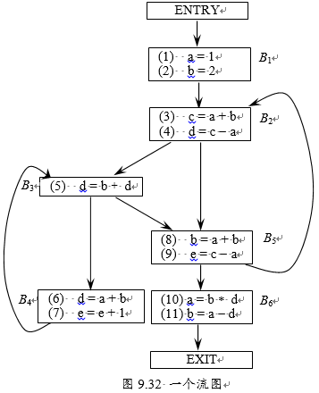

# H11

## 9.1
对于图9.32流图：  
(a) 识别该流图的循环。  
(b) 块B1中的语句(1)和(2)都是复写语句，并且它们给a和b赋的都是常量。可以对a和b的哪些引用实施复写传播并将这些引用替换成对常量的引用？  
(c) 识别每个循环的全局公共子表达式。  
(d) 识别每个循环的归纳变量，不要忘记把(b)的复写传播引入的常量考虑进去。  
(e) 识别每个循环的循环不变计算  


### (a)
1. {B2, B3, B4, B5}
2. {B3, B4}
3. {B2, B3, B5}
4. {B2, B5}
### (b)
- B2 中的 (3): `c = a + b` 可换为 `c = 1 + b`
- B2 中的 (4): `d = c - a` 可换为 `d = c - 1`
- B4 中的 (6): `d = a + b` 可换为 `d = 1 + b`
- B5 中的 (8): `b = a + b` 可换为 `b = 1 + b`
- B5 中的 (9): `e = c - a` 可换为 `e = c - 1`
### (c)
- 在循环 {B2, B5}, {B2, B3, B5}, {B2, B3, B4, B5} 中, 
  - 在 B2 的 `c = a + b` 和 B5 中的 `b = a + b`, 其中 `a + b` 为公共子表达式.
  - 在 B2 的 `d = c - a` 和 B5 中的 `e = c - a`, 其中 `c - a` 为公共子表达式.
### (d)
1. {B2, B3, B4, B5} 有归纳变量 `b`
2. {B3, B4} 有归纳变量 `e`
3. {B2, B3, B5} 有归纳变量 `b`
4. {B2, B5} 有归纳变量 `b`
### (e)
- {B3, B4} 中的 `d = a + b` 中的 `a + b` 是循环不变.

## 9.3
对图9.32的流图，计算：
(b). 为可用表达式分析，计算每个块的e_gen、e_kill、IN和OUT集合。

(c). 为活跃变量分析，计算每个块的def、use、IN和OUT集合。

### (b)
|Block|e_gen|e_kill|
|:-|:-|:-|
|B1|1,2|8,10,11|
|B2|3,4|5,6|
|B3|5|4,6|
|B4|6,7|4,5,9|
|B5|8,9|2,7,11|
|B6|10,11|1,2,8|

从而根据
$$\begin{aligned}
OUT[B]=e\_gen_B\cup (IN[B]-e\_kill_B)\\
IN[B]=\cap_{P是B的前驱}OUT[P]
\end{aligned}$$
开始迭代.  

第 1 轮(这里用集合表示看起来比较简练):
|Block|IN|OUT|
|:-|:-|:-|
|B1|{}|{1,2}|
|B2|{}|{3,4}|
|B3|{}|{5}|
|B4|{5}|{6,7}|
|B5|{}|{8,9}|
|B6|{9}|{10,11}|

第 2 轮迭代就发现已经没有出现 OUT 变化了, 因此已经结束.

### (c)

|Block|use|def|
|:-|:-|:-|
|B1||a,b|
|B2|a,b,c|c,d|
|B3|b,d|d|
|B4|a,b,e|d,e|
|B5|a,b,c|b,e|
|B6|a,b,d|a,b|

根据
$$\begin{aligned}
OUT[B]=\cup_{S是B的后继}IN[S]\\
IN[B]=use_B\cup (OUT[B]-def_B)
\end{aligned}$$
开始迭代.  

第 1 轮:
|Block|后继|IN|OUT|
|:-|:-|:-|:-|
|B1|B2      |{c,e}|{a,b,c,e}|
|B2|B3,B5   |{a,b,c,e}|{a,b,c,d,e}|
|B3|B4,B5   |{a,b,c,d,e}|{a,b,c,d,e}|
|B4|B3      |{a,b,e}|{}|
|B5|B2,B6   |{a,b,c,d}|{a,b,d}|
|B6|EXIT    |{a,b,d}|{}|

第 2 轮:
|Block|后继|IN|OUT|
|:-|:-|:-|:-|
|B1|B2      |{c,e}|{a,b,c,e}|
|B2|B3,B5   |{a,b,c,e}|{a,b,c,d,e}|
|B3|B4,B5   |{a,b,c,d,e}|{a,b,c,d,e}|
|B4|B3      |{a,b,c,e}|{a,b,c,d,e}|
|B5|B2,B6   |{a,b,c,d}|{a,b,c,d,e}|
|B6|EXIT    |{a,b,d}|{}|

第 3 轮迭代没有 IN 会发生变化了. 因此第 2 轮结果即为最终结果.


## 9.31
下面的C程序分别经非优化编译和2级以上（含2级）的优化编译后，生成的两个目标程序运行时的表现不同（编译器是GCC: (GNU)  7.5.0  (Ubuntu 7.5.0-3ubuntu1~18.04)）。请回答它们运行时的表现有何不同，并说明原因。

```c
int f(int g()) {
    return g(g);
}
main() {
    f(f);
}
```

- 非优化编译的结果会出现段错误
- O2 优化编译的结果会出现程序被阻塞住的现象.

其原因就需要查看编译结果的代码了.

- 非优化编译结果之所以会段错误, 显然就是因为函数调用爆栈了.
- 而 O2 优化编译结果之所以没有, 这是因为尾递归被优化成循环了.
    ```s
    f:
    .LFB0:
        .cfi_startproc
        endbr64
        xorl	%eax, %eax
        jmp	*%rdi
        .cfi_endproc
    ```